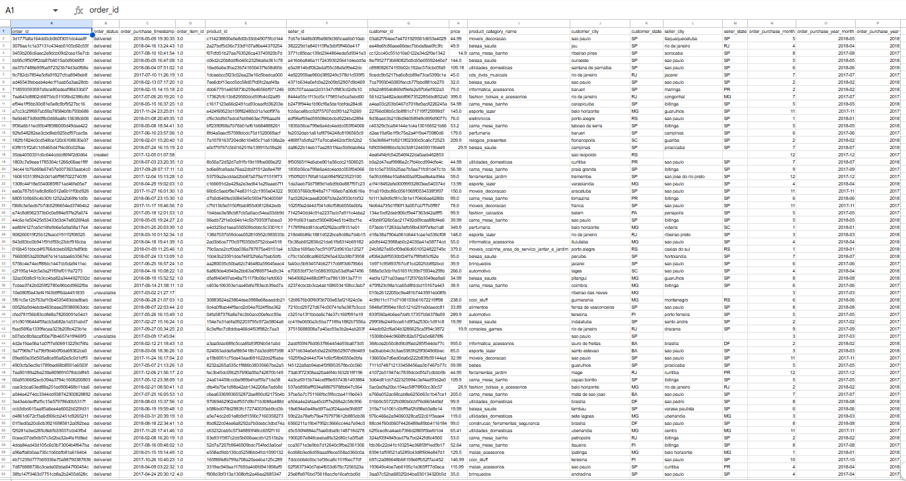

# 📊 Por que os pedidos caíram em 2018 — e o que fazer a respeito

Análise de uma base histórica de **4.000 pedidos de e-commerce (2017–2018)**, construída inteiramente no Google Sheets, para responder uma pergunta de negócio concreta: **o volume de pedidos desacelerou ao longo de 2018 — por quê, e onde vale a pena agir?**

O projeto percorre as 4 etapas clássicas da análise de dados — descritiva, diagnóstica, preditiva e prescritiva — usando a mesma base do início ao fim, cada etapa respondendo a uma pergunta diferente sobre esse problema.

> 📁 Planilha completa (todas as abas, fórmulas e gráficos): [`Exercicio Analise de dados em producao.xlsx`](./Exercicio%20Analise%20de%20dados%20em%20producao.xlsx)

**⚠️ Limitações, de forma transparente:** a amostra é de 4.000 pedidos (não a base completa), e toda a análise foi feita em Google Sheets, sem Python/SQL. Isso foi proposital — o objetivo aqui era dominar o raciocínio analítico com as ferramentas mais acessíveis possíveis. Um próximo passo natural seria migrar o pipeline para Python/SQL com a base completa, ganhando escala e reprodutibilidade.

---

## Sumário
- [A base de dados](#a-base-de-dados)
- [1. Descritiva — o que aconteceu](#1-descritiva--o-que-aconteceu)
- [2. Diagnóstica — por que aconteceu](#2-diagnóstica--por-que-aconteceu)
- [3. Preditiva — o que deve acontecer](#3-preditiva--o-que-deve-acontecer)
- [4. Prescritiva — o que fazer a respeito](#4-prescritiva--o-que-fazer-a-respeito)
- [Conclusão](#-conclusão)
- [Ferramentas e técnicas](#️-ferramentas-e-técnicas)
- [Sobre mim](#-sobre-mim)

---

## A base de dados

4.000 pedidos de um marketplace, entre janeiro/2017 e agosto/2018, com dados de cliente, vendedor, produto, categoria, preço e localização geográfica de cada pedido.



---

## 1. Descritiva — o que aconteceu

**Pergunta:** de onde vêm os pedidos, e como eles estão distribuídos ao longo do tempo e do território?

**O que foi feito:**
- Contagem de pedidos por mês, para visualizar a tendência geral do negócio.
- Contagem de pedidos por categoria de produto, para ver onde está concentrado o volume.
- Uma **Curva de Pareto** — gráfico que mostra quantas categorias/estados já respondem por 80% dos pedidos. Serve pra responder "onde é que está a maior parte do meu negócio?" sem precisar olhar centena de linhas.
- Mapeamento geográfico de pedidos por estado do cliente e por estado do vendedor.


A tendência mensal já mostra o padrão que puxa o resto da análise: **crescimento forte em 2017, pico em novembro (Black Friday), e depois uma acomodação em patamar mais baixo ao longo de 2018** — sem voltar a crescer no mesmo ritmo.


A curva de Pareto confirma concentração: poucas categorias (cama_mesa_banho, beleza_saude, esporte_lazer...) já respondem por boa parte do volume, e os pedidos — tanto de quem compra quanto de quem vende — estão fortemente concentrados em **São Paulo**.

---

## 2. Diagnóstica — por que aconteceu

**Pergunta:** por que os pedidos desaceleraram em 2018, especificamente?

**O que foi feito:**
- Cálculo do crescimento percentual mês a mês (**MoM**, *month-over-month* — ou seja, "quanto esse mês cresceu ou caiu em relação ao mês anterior") para pedidos, clientes, vendedores, produtos, categorias e preço médio.
- Cálculo da **correlação** entre pedidos e cada uma dessas variáveis, separadamente para 2017 e 2018. Correlação aqui mede o quanto duas variáveis "andam juntas" — de -1 (andam em direções opostas) a +1 (andam sempre na mesma direção).


As tabelas de correlação mostram algo que muda de um ano pro outro: em 2017, **preço médio** tem correlação quase nula com pedidos (-0,10 e -0,51 dependendo do corte). Em 2018, essa correlação vira **negativa e relevante (-0,60)** — ou seja, quando o preço médio subiu, os pedidos caíram junto. Isso é reforçado pela correlação de **clientes com pedidos**, que se mantém próxima de 1,0 nos dois anos: onde tem menos comprador, tem menos pedido — simples assim.


Olhando o crescimento de produtos, preço médio e categorias mês a mês em 2018, dá pra ver os sinais batendo: quedas e reduções recorrentes no meio do ano, sem grandes altas que compensem.

**Diagnóstico registrado na própria planilha, com base nesse cruzamento:**

> A queda no número de pedidos em 2018 e o aumento do preço médio tiveram forte influência da diminuição do número de compradores. Além disso, a queda no número de vendedores e a estabilização do total de categorias mostram uma estagnação tanto na entrada de novos vendedores quanto no lançamento de novos produtos.

---

## 3. Preditiva — o que deve acontecer

**Pergunta:** quantos pedidos devemos esperar nos próximos 4 meses (set–dez/2018)?

**O que foi feito:**
- Decomposição clássica de série temporal: a série de pedidos foi quebrada em **ciclo trimestral**, **CMA** (*Centered Moving Average*, média móvel centrada — uma forma de suavizar a série e enxergar a tendência real, sem o "ruído" de cada mês isolado), **índice de sazonalidade** (o quanto cada posição do trimestre tende a desviar da média) e **tendência**.
- Depois de "limpar" a série da sazonalidade, foi ajustada uma **regressão linear** sobre a tendência restante, pra projetar os próximos meses.
- Por fim, a sazonalidade foi reaplicada sobre a tendência projetada, gerando a previsão final mês a mês.


A regressão explica **73,7% da variação da tendência** (R² = 0,737 — métrica que indica o quanto do comportamento da série o modelo consegue explicar; quanto mais perto de 1, melhor o ajuste) e é estatisticamente significativa (p-valor < 0,001). A previsão resultante:

| Mês | Previsão de pedidos |
|---|---|
| set/2018 | ≈ 302 |
| out/2018 | ≈ 373 |
| nov/2018 | ≈ 383 |
| dez/2018 | ≈ 337 |

A leitura prática: mesmo com a sazonalidade de fim de ano puxando os números pra cima, a previsão **não retoma o pico de novembro/2017** — o que reforça que o problema não é sazonal, é estrutural.

---

## 4. Prescritiva — o que fazer a respeito

**Pergunta:** dado que eu quero recuperar o volume de pedidos, em qual alavanca vale mais a pena investir?

**O que foi feito:**
- Todas as variáveis (clientes, vendedores, produtos, categorias, preço médio) foram **padronizadas em z-score** — ou seja, colocadas na mesma escala, pra poder comparar o peso de cada uma de forma justa (sem isso, uma variável em "reais" e outra em "unidades" não seriam comparáveis).


- Uma primeira regressão múltipla foi rodada **sem incluir "clientes"**, usando só vendedores, produtos, categorias e preço médio:


Nesse modelo, **"produtos" aparece com peso altíssimo e estatisticamente muito significativo** (coeficiente 1,45, p-valor praticamente zero) — à primeira vista, pareceria que expandir o catálogo é o caminho.

- Só que, ao rodar a **mesma regressão incluindo "clientes"**, o cenário muda completamente:


Com "clientes" no modelo, o peso de "produtos" **praticamente desaparece** (cai para -0,03, deixa de ser estatisticamente significativo) e **"clientes" assume disparado o maior peso** (coeficiente 1,02, com significância quase perfeita). O modelo final:

```
pedidos ≈ 1.02 × clientes + 0.02 × vendedores − 0.03 × produtos − 0.01 × categorias + 0.001 × preço médio
```

**Por que isso importa:** esse é um exemplo clássico de **variável confusora** — "produtos" só parecia relevante porque cresce junto com "clientes" (mais gente comprando naturalmente puxa mais variedade de produto vendido), mas quem realmente movimenta pedidos é a base de clientes, não o tamanho do catálogo. Rodar as duas versões da regressão foi o que permitiu identificar isso, em vez de tirar uma conclusão errada da primeira.

---

## 🎯 Conclusão

> **Nota:** este projeto foi feito originalmente em uma disciplina, há alguns meses — a conclusão abaixo é minha leitura direta dos números da planilha, não necessariamente a intenção original do exercício.

As quatro etapas convergem para o mesmo ponto por caminhos diferentes:
- a **descritiva** mostra que o pico de 2017 não voltou a se repetir em 2018;
- a **diagnóstica** aponta queda no número de compradores como o fator mais correlacionado com a queda de pedidos;
- a **preditiva** projeta que essa desaceleração deve continuar nos próximos meses, mesmo com a sazonalidade de fim de ano;
- e a **prescritiva** comprova estatisticamente que **"clientes" é a variável com maior poder de explicação sobre pedidos**, muito acima de vendedores, produtos, categorias ou preço médio — inclusive desmascarando "produtos" como uma correlação espúria.

**Recomendação de negócio:** priorizar ações de **aquisição e retenção de clientes** (marketing de performance, cupom de primeira compra, programa de indicação) em vez de expandir catálogo ou base de vendedores, que — isoladamente — têm impacto estatístico marginal sobre o volume de pedidos.

---

## 🛠️ Ferramentas e técnicas

- **Google Sheets** como ferramenta única (tabelas dinâmicas, fórmulas condicionais, `CORREL`, regressão via *Data Analysis*, mapas geográficos nativos)
- Estatística descritiva (Pareto, distribuição de frequência)
- Correlação e variação percentual mês a mês (MoM)
- Decomposição clássica de série temporal (ciclo, CMA, sazonalidade, tendência)
- Regressão linear simples e múltipla, com padronização z-score

---

## 📁 Estrutura do repositório

```
ANALYTICS_PROJECT/
├── README.md
├── Exercicio Analise de dados em producao.xlsx
└── images/
    ├── dados_historicos_vendas.png
    ├── painel_descritivo_1.png
    ├── painel_descritivo_2.png
    ├── diagnostica_1.png
    ├── diagnostica_2.png
    ├── preditiva_1_1.png
    ├── preditiva_1.png
    ├── prescritiva_1.png
    ├── prescritiva_3.png
    └── prescritiva_2.png
```

---

## 👋 Sobre mim

*Adicione aqui 2–3 linhas sobre você e seu momento de carreira, + link do LinkedIn e/ou e-mail de contato.*

Se quiser trocar uma ideia sobre a metodologia ou próximos passos desse projeto (ex: migração pra Python/SQL), fico à disposição.
