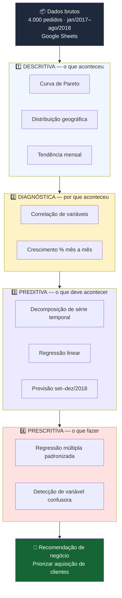
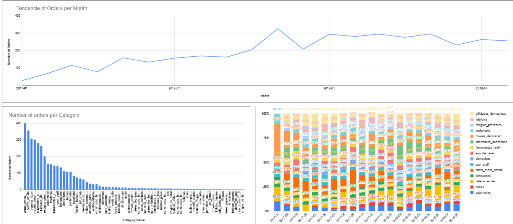
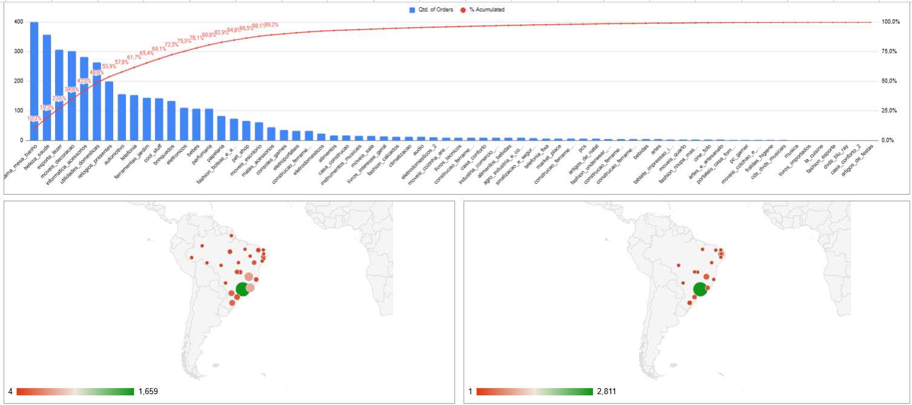
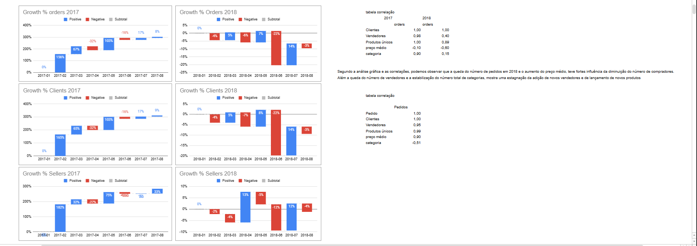
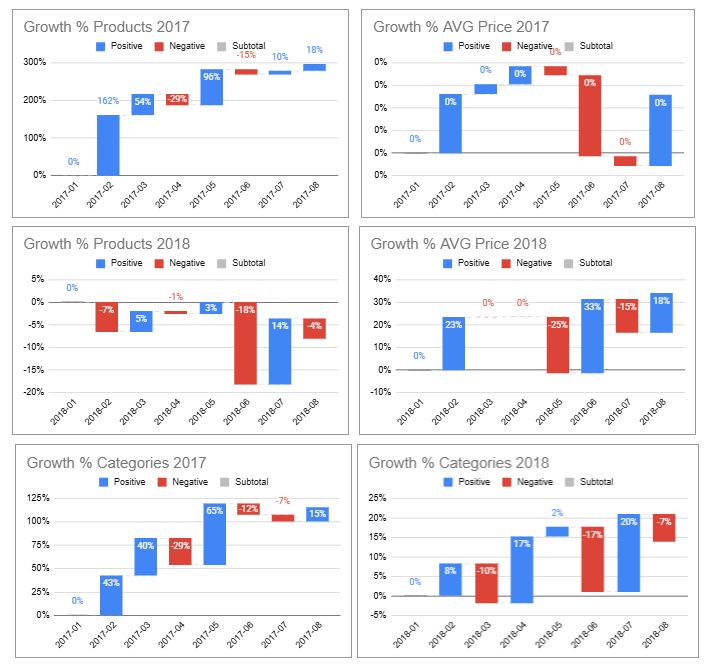
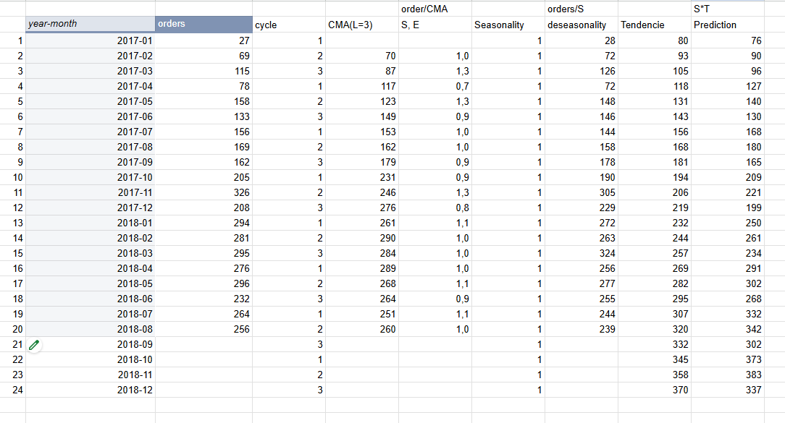
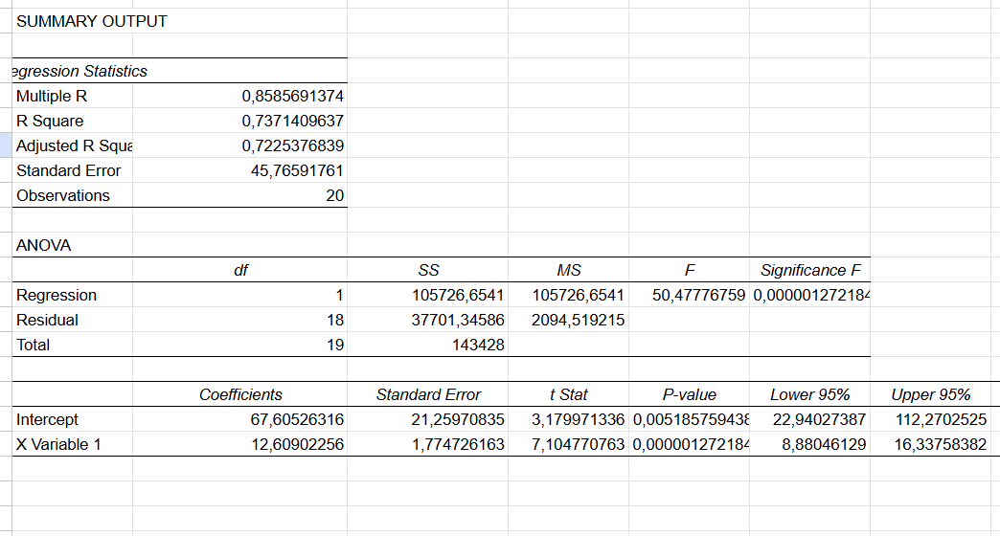
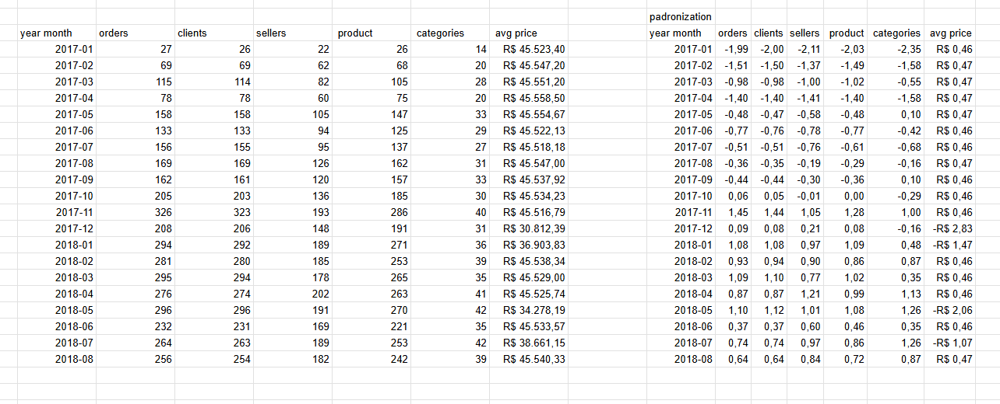
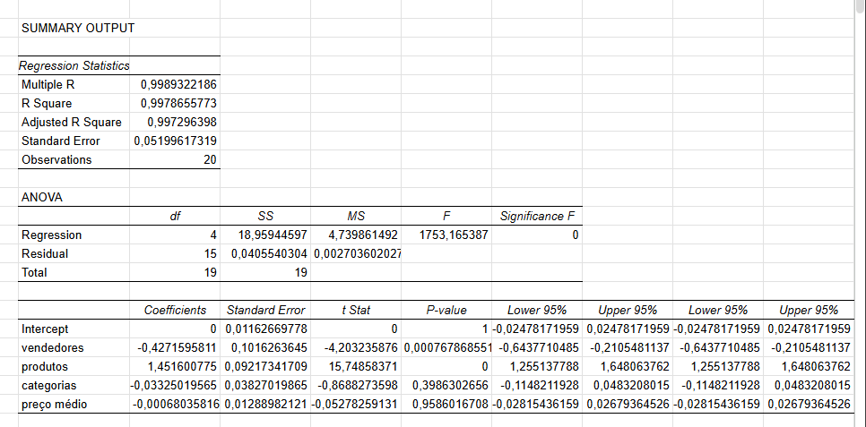
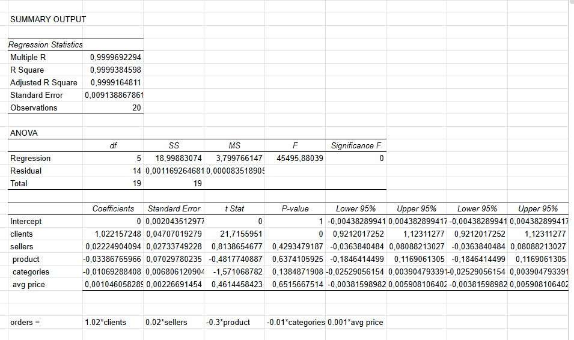

# 📊 Análise de Vendas E-commerce ( Descritiva, Diagnóstica, Preditiva e Prescritiva )

**Por que os pedidos caíram em 2018, e onde vale a pena agir para reverter isso.**

---

## 1. Problema

Uma base de **4.000 pedidos de e-commerce (jan/2017 - ago/2018)** mostrava crescimento forte em 2017, mas **desacelerou ao longo de 2018** sem retomar o ritmo anterior.

**Pergunta de negócio:** por que os pedidos caíram, e em qual alavanca (clientes, vendedores, catálogo, preço) vale mais a pena investir para reverter a tendência?

Este projeto responde essa pergunta percorrendo as 4 etapas clássicas da análise de dados, cada uma respondendo uma pergunta diferente sobre o mesmo problema, com a mesma base do início ao fim.

---

## 2. Arquitetura

> Este é um projeto de análise de dados, então "arquitetura" aqui é o **pipeline analítico**: como o dado bruto vira, em 4 estágios, uma recomendação de negócio acionável.



Cada estágio consome a saída do anterior : a descritiva mapeia o sintoma, a diagnóstica investiga a causa, a preditiva projeta o efeito futuro, e a prescritiva testa qual alavanca realmente resolve o problema.

---

## 3. Stack

| Categoria | Ferramenta / Técnica |
|---|---|
| Plataforma | Google Sheets (única ferramenta usada, do início ao fim) |
| Estatística descritiva | Curva de Pareto, distribuição de frequência, mapas geográficos |
| Estatística diagnóstica | Correlação (`CORREL`), variação % mês a mês (MoM) |
| Séries temporais | Decomposição clássica (ciclo, CMA, sazonalidade, tendência) |
| Modelagem preditiva | Regressão linear simples (Data Analysis Toolpak) |
| Modelagem prescritiva | Regressão linear múltipla com variáveis padronizadas (z-score) |

**Limitação assumida:** amostra de 4.000 pedidos (não a base completa) e sem Python/SQL : escolha proposital para focar no raciocínio analítico com a ferramenta mais acessível. Próximo passo natural: migrar para Python/SQL com a base completa (ver seção 5).

---

## 4. Implementação

### 1️⃣ Descritiva
Contagem de pedidos por mês e por categoria, curva de Pareto (80/20) e mapeamento geográfico de pedidos por estado do cliente e do vendedor.




**Achado:** pico em novembro/2017 (Black Friday) não se repete em 2018; pedidos concentrados em poucas categorias e fortemente em São Paulo.

### 2️⃣ Diagnóstica
Correlação entre pedidos e clientes/vendedores/produtos/categorias/preço médio, separada por ano, + crescimento % mês a mês.




**Achado:** correlação clientes×pedidos ~1,0 nos dois anos; correlação preço médio×pedidos vira negativa em 2018 (-0,60). Diagnóstico: queda de compradores + alta de preço médio + estagnação de vendedores/catálogo.

### 3️⃣ Preditiva
Decomposição da série (ciclo, CMA, sazonalidade, tendência) → regressão linear sobre a tendência dessazonalizada → reaplicação da sazonalidade para prever set–dez/2018.




**Achado:** R² = 0,737, p < 0,001. Previsão: **302 → 373 → 383 → 337** pedidos (set a dez/2018) — mesmo com sazonalidade de fim de ano, não retoma o pico de nov/2017.

### 4️⃣ Prescritiva
Regressão múltipla com variáveis padronizadas (z-score), rodada duas vezes: sem e com a variável "clientes".





**Achado:** sem "clientes" no modelo, "produtos" parece decisivo (coef. 1,45). Ao incluir "clientes", o peso de "produtos" desaparece (cai a -0,03, não significativo) e **"clientes" domina** (coef. 1,02) — clássico caso de **variável confusora**: "produtos" só parecia importante por andar junto com "clientes".

```
pedidos ≈ 1.02 × clientes + 0.02 × vendedores − 0.03 × produtos − 0.01 × categorias + 0.001 × preço médio
```

> 📁 Planilha completa (todas as abas, fórmulas e gráficos): [`Exercicio_Analise_de_dados_em_producao.xlsx`](./Exercicio_Analise_de_dados_em_producao.xlsx)

---

## 5. Resultados, Aprendizados e Próximos Passos

**Resultado / recomendação de negócio:**
As 4 etapas convergem: **aquisição e retenção de clientes** é a alavanca com maior poder de explicação sobre pedidos, sendo muito acima de expandir catálogo ou base de vendedores, que têm impacto estatístico pequeno quando isolados do efeito de clientes.

**Aprendizado técnico principal:**
Rodar a regressão prescritiva com e sem "clientes" expôs uma **variável confusora**: "produtos" parecia relevante isoladamente, mas era um efeito colateral do crescimento da base de clientes. Sem esse teste, a conclusão teria sido incorreta.

**Próximos passos:**
- Migrar o pipeline para **Python/SQL** e rodar sobre a base completa (não a amostra de 4.000 pedidos)
- Automatizar a atualização mensal dos indicadores (hoje o processo é manual, aba a aba)
- Testar a recomendação com um experimento controlado (ex: campanha de aquisição em uma região vs. grupo controle)

> **Nota sobre a conclusão:** este projeto foi feito originalmente há alguns meses. A leitura acima é a minha interpretação direta dos números da planilha.

---

## 👋 Contato

*Adicione aqui 2–3 linhas sobre você e seu momento de carreira, + link do LinkedIn e/ou e-mail de contato.*
